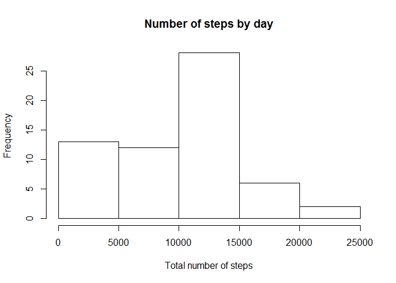
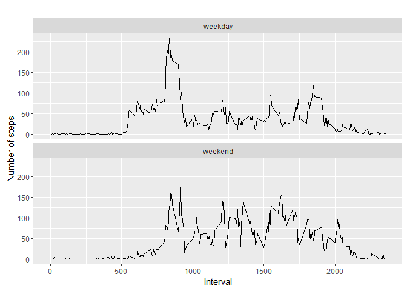

1 Code for reading in the dataset and/or processing the data

    monitoring_data <- read.csv(file='activity.csv',head=TRUE,sep = ",")

    summary(monitoring_data)

    ##      steps                date          interval     
    ##  Min.   :  0.00   2012-10-01:  288   Min.   :   0.0  
    ##  1st Qu.:  0.00   2012-10-02:  288   1st Qu.: 588.8  
    ##  Median :  0.00   2012-10-03:  288   Median :1177.5  
    ##  Mean   : 37.38   2012-10-04:  288   Mean   :1177.5  
    ##  3rd Qu.: 12.00   2012-10-05:  288   3rd Qu.:1766.2  
    ##  Max.   :806.00   2012-10-06:  288   Max.   :2355.0  
    ##  NA's   :2304     (Other)   :15840

2 Histogram of the total number of steps taken each day

    steps_by_day <- tapply(monitoring_data$steps, monitoring_data$date, FUN = sum, na.rm = TRUE)

    hist(steps_by_day, xlab = "Total number of steps", main="Number of steps by day")

3 Mean and median number of steps taken each day

    mean(steps_by_day, na.rm = TRUE)

    ## [1] 9354.23

    median(steps_by_day, na.rm = TRUE)

    ## [1] 10395

4 Time series plot of the average number of steps taken

    steps_by_interval <- setNames(aggregate(monitoring_data$steps ~ monitoring_data$interval, monitoring_data$data, mean), c("interval","steps"))

    plot(steps_by_interval$interval, steps_by_interval$steps, type='l', 
         main="Average number of steps over all days", xlab="Interval", 
         ylab="Average number of steps")

5 The 5-minute interval that, on average, contains the maximum number of
steps

    max(steps_by_interval$steps)

    ## [1] 206.1698

6 Code to describe and show a strategy for imputing missing data

    missing <- is.na(monitoring_data$steps)

    table(missing)

    ## missing
    ## FALSE  TRUE 
    ## 15264  2304

    fill.value <- function(steps, interval) {
      filled <- NA
      if (!is.na(steps)) 
        filled <- c(steps) else filled <- (steps_by_interval[steps_by_interval$interval == interval, "steps"])
        return(filled)
    }
    filled.data <- monitoring_data
    filled.data$steps <- mapply(fill.value, filled.data$steps, filled.data$interval)
    total.steps <- tapply(filled.data$steps, filled.data$date, FUN = sum)

7 Histogram of the total number of steps taken each day after missing
values are imputed

    hist(steps_by_day, xlab = "Total number of steps", main="Number of steps by day")

8 Panel plot comparing the average number of steps taken per 5-minute
interval across weekdays and weekends

    library(ggplot2)

    ## Warning: package 'ggplot2' was built under R version 3.2.5

    monitoring_data$date <- as.Date(monitoring_data$date, "%Y-%m-%d")

    monitoring_data$day <- weekdays(monitoring_data$date)

    monitoring_data$day_type <- c("weekday")

    for (i in 1:nrow(monitoring_data)){
      if (monitoring_data$day[i] == "sábado" || monitoring_data$day[i] == "domingo"){
        monitoring_data$day_type[i] <- "weekend"
      }
    }

    monitoring_data$day_type <- as.factor(monitoring_data$day_type)

    table_interval_steps_imputed <- aggregate(steps ~ interval+day_type, monitoring_data, mean)

    qplot(interval, steps, data=table_interval_steps_imputed, geom=c("line"), xlab="Interval", 
          ylab="Number of steps", main="") + facet_wrap(~ day_type, ncol=1)

